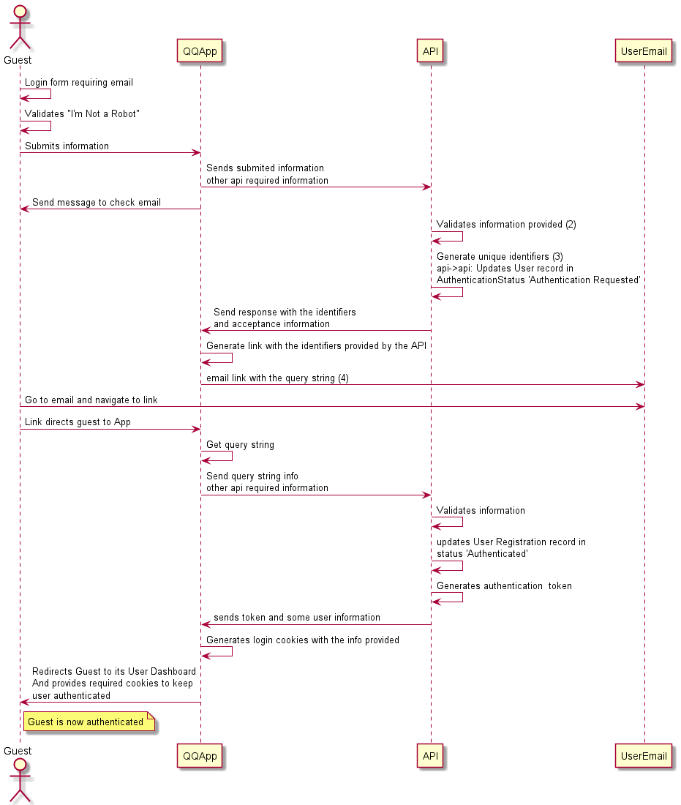

# Requirements

## Definitions

> **Guest:**  User who is not authenticated

> **User:** User who is registered and authenticated

> **Session:** Dashboard where a user shares quizzes and guests who joined the session can answer each quiz (a user can join another user's session but is anonymous). Session controls the number of guests that join, status of the session, geolocation, etc...

> **Session Owner:** A User who started a session and shared a session code with guests

> **Quiz:** A question that is presented to the guests on the session and offers three types of answers, multi-choice, short answer and long answer

> **Session Template:** A template with all the quizzes a user wishes to use on a session with respective configurations, for example, how to release the quizzes (1 by 1, all, etc.), timeout for the session, number of guests that can join the session, guests need to provide geolocation, radius of geolocation, etc...

## User

Once a authenticated the user will be directed to a user dashboard. On the Dashboard the user will be able to select the following options:

- Start a session
- Create a session template
- View sessions history
- Manage profile details (display name, for example)
- Join an ongoing session (as guest)

## Guest

Everyone that is not authenticated is a guest and can do the following:

- Join a session using a session code provided by a user (session owner)
- Log in (Authenticate)
- Register a new user

## Session

A Session is created by a user based on a session template or an empty session where quizzes are created within the session. This action generates a session code which can be shared with guests to join this session.
A user will be able to control the session state:

- Manage Session status (started, closed)
- See how many guests have joined (after session is started)
- Release quizzes for guests to answer
- Manage quiz status (started, closed)
- See answers of a closed quiz
- Create a new quiz
  
A guest is able to join a session by adding the session code, sharing its location (if requested) and the number of guests has not exceeded what was configured for the session. Once the guest joins the session it will be presented with a session dahsboard where quizzes will appear. The guest will then be able to provide an answer to the quiz while the quiz is in an open status. Wants an answer is submited, the guest will back at the dashboard and answer any other quizzes available. The guest will be able to change his answer on any quiz that is still not in a closed status.

Once the session is closed, a guest can download the contents of the session (quizzes and its own answers) if allowed by the session owner for a pre- determined time. The session is added to the users session history where the user is able to access the quizzes (from the template or created during the session) and all answers given byt the guests.

## Other considerations

To prevent the abuse of the system, for example, a bot regitering users, or unwanted guests joing a session we have thought of the use of some solutions that can mitigate the problem:

- Registering:
  - On Registering a user, a valid email needs to be provided. Once the form is submited, an email is generated with a link. Once the user navigates to that link, the registration is accepted.
  - Use google's Recaptcha, "I'm Not A Robot" (for example)

- Log in / Authenticate
  - Guest submits an email and if email exists the guest will receive a link to login
  - Application will ask the guest to check the provided email.
    - This link will contain a query string with the necessary information to identify the user and validate its login request.
    - Once validated the User will be redirected to its dashboard
    - If info has expired, guest will be requested to log in again
  - If email does not exist, no email is sent

### Registration workflow

- (1) -> Email, Display Name.
- (2) -> Validates if email already exists
- (3) -> Generates a Unique Registration/Login identifier and persists it on the new User record
- (4) -> query string will contain the email and registration/login identifier encoded in base64

### Login workflow

- (1) -> Email
- (2) -> Validates if email already exists
- (3) -> Generates a Unique Login identifier and persists it on the new User record
- (4) -> Query string will contain the email and registration/login identifier encoded in base64

### Session workflow (User)

- (1) ->

### Session workflow (Guest)

- (1) ->